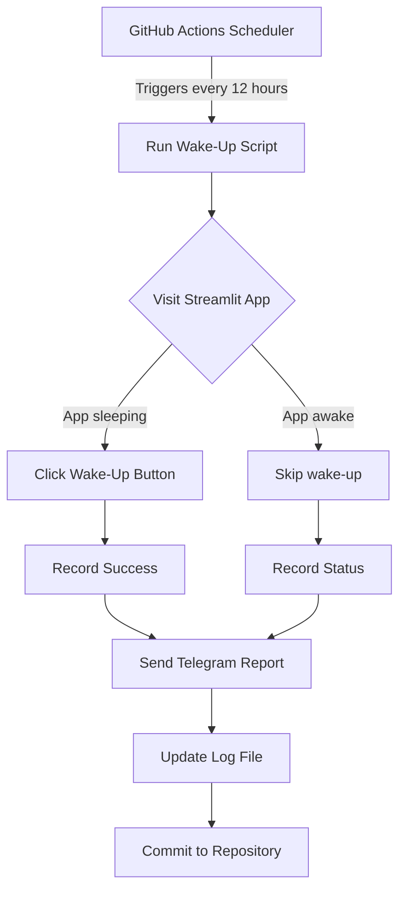

<h1 align="center">Streamlit Auto Wake and Status Reporter via Telegram</h1>


A GitHub Actions-powered bot to automatically wake up your free Streamlit apps using Selenium, and send you real-time status reports via Telegram.

This project is ideal for keeping your Streamlit apps responsive and minimizing cold-start delays caused by inactivity on the free tier.

---

## Features

- ⏰ Automatically runs every 12 hours (or manually) via GitHub Actions.
- 🌐 Opens and checks Streamlit app URLs using a headless browser (Selenium).
- 🔘 Detects and clicks the “wake up” button if the app is sleeping.
- ✅ Differentiates between **already awake**, **just woken up**, and **unreachable** states.
- 💬 Sends a summary to Telegram with the wake-up status of each app.
- 📊 App status is logged with a timestamp in a local CSV file (`wake_up_log.csv`).

---

## 🛠️ Requirements

- Python 3.10
- `selenium`, `webdriver_manager`, `requests`

Install dependencies:

```bash
pip install -r requirements.txt
```

## How It Works

# 🔐 Environment Variables

Set these environment variables (in GitHub Secrets or `.env` file):

| Variable Name        | Description                          |
|----------------------|--------------------------------------|
| `TELEGRAM_BOT_TOKEN` | Your Telegram bot API token          |
| `TELEGRAM_CHAT_ID`   | Your personal or group chat ID       |

---

# 🧾 CSV Log Output

Each run appends a new row to `wake_up_log.csv`:

| timestamp           | clearsight    | incident_management   |
|---------------------|---------------|------------------------|
| 2025-07-22 00:00:00 | clicked       | already_awake          |

---

# 📬 Telegram Message Format

### Example Message Sent:
```txt
📡 Streamlit Wake-Up Report (2025-07-22 00:00:00 IST):

🟢 Clearsight was asleep and has been woken up.

🟡 Incident Management is already awake.

🔴 Incident Management could not be reached. Error: TimeoutException
```
